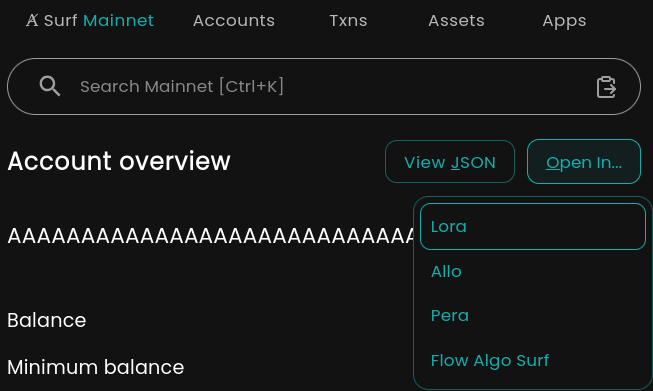

# "Open In" for Algorand

- Data Registry of supported networks and page types for explorers and dApps.
- Utility to generate Algorand explorer and dApp links for use in dApps and tools.

## Usage

```ts
import { getOpenInEntries } from '@d13/open-in';

/*
Example: You want to offer "open-in" / navigation options for testnet asset 10010 
Which explorers/dApps support this?
What is the correct URL for the network, pageType and id? 
*/
const sites = getOpenInEntries('testnet', 'asset');

for (const site of sites) {
  const url = site.getUrl('testnet', 'asset', '10010');
  console.log(`Site Name: "${site.siteName}"; URL: "${url}"`);
}

/*
Site Name: "Pera"; URL: "https://testnet.explorer.perawallet.app/asset/10010"
Site Name: "Lora"; URL: "https://lora.algokit.io/testnet/asset/10010"
Site Name: "Algo Surf"; URL: "https://testnet.algo.surf/asset/10010/transactions"
*/
```

## Example Options

This section is generated by `npx tsx examples/example.ts` for different network & page type scenarios. It is not guarranteed to be up to date with the latest registry entries.

### Entries for { PageType: transaction, Network: testnet, ID: QOOBRVQMX4HW5QZ2EGLQDQCQTKRF3UP3JKDGKYPCXMI6AVV35KQA }

- Site Name: Pera
  - Category: explorer
  - URL: https://testnet.explorer.perawallet.app/tx/QOOBRVQMX4HW5QZ2EGLQDQCQTKRF3UP3JKDGKYPCXMI6AVV35KQA

- Site Name: Lora
  - Category: explorer
  - URL: https://lora.algokit.io/testnet/transaction/QOOBRVQMX4HW5QZ2EGLQDQCQTKRF3UP3JKDGKYPCXMI6AVV35KQA

- Site Name: Algo Surf
  - Category: explorer
  - URL: https://testnet.algo.surf/transaction/QOOBRVQMX4HW5QZ2EGLQDQCQTKRF3UP3JKDGKYPCXMI6AVV35KQA

### Entries for { PageType: account, Network: mainnet, ID: AAAAAAAAAAAAAAAAAAAAAAAAAAAAAAAAAAAAAAAAAAAAAAAAAAAAY5HFKQ }

- Site Name: Allo
  - Category: explorer
  - URL: https://allo.info/address/AAAAAAAAAAAAAAAAAAAAAAAAAAAAAAAAAAAAAAAAAAAAAAAAAAAAY5HFKQ

- Site Name: Pera
  - Category: explorer
  - URL: https://explorer.perawallet.app/address/AAAAAAAAAAAAAAAAAAAAAAAAAAAAAAAAAAAAAAAAAAAAAAAAAAAAY5HFKQ

- Site Name: Lora
  - Category: explorer
  - URL: https://lora.algokit.io/mainnet/account/AAAAAAAAAAAAAAAAAAAAAAAAAAAAAAAAAAAAAAAAAAAAAAAAAAAAY5HFKQ

- Site Name: Algo Surf
  - Category: explorer
  - URL: https://algo.surf/account/AAAAAAAAAAAAAAAAAAAAAAAAAAAAAAAAAAAAAAAAAAAAAAAAAAAAY5HFKQ

- Site Name: Flow Algo Surf
  - Category: analytics
  - URL: https://flow.algo.surf/address/AAAAAAAAAAAAAAAAAAAAAAAAAAAAAAAAAAAAAAAAAAAAAAAAAAAAY5HFKQ

### Entries for { PageType: block, Network: fnet, ID: 1 }

- Site Name: Lora
  - Category: explorer
  - URL: https://lora.algokit.io/fnet/block/1

- Site Name: Algo Surf
  - Category: explorer
  - URL: https://fnet.algo.surf/block/1/transactions

### Entries for { PageType: application, Network: betanet, ID: 1002 }

- Site Name: Lora
  - Category: explorer
  - URL: https://lora.algokit.io/betanet/application/1002

- Site Name: Algo Surf
  - Category: explorer
  - URL: https://betanet.algo.surf/application/1002/transactions

### Entries for { PageType: asset, Network: localnet, ID: 1002 }

- Site Name: Lora
  - Category: explorer
  - URL: https://lora.algokit.io/localnet/asset/1002

- Site Name: Algo Surf
  - Category: explorer
  - URL: https://localnet.algo.surf/asset/1002/transactions

## Used By

### Algo Surf



[Example Mainnet account](https://algo.surf/account/AAAAAAAAAAAAAAAAAAAAAAAAAAAAAAAAAAAAAAAAAAAAAAAAAAAAY5HFKQ/)

## Development

### Install dependencies

```sh
pnpm install
```

### Contributing your dApp as an Open In Entry

Want your explorer or dApp to be included? Submit your own Entry!

1. Install dependencies (see below)
2. Copy `src/Entries/_EntryTemplate.ts` to a new file (e.g., `src/Entries/MyDappEntry.ts`).
3. Rename the class and file to match your entry.
4. Fill in the required fields and customize the logic as needed:
   - `siteName`: The display name of your site or dApp
   - `category`: The category (e.g., 'explorer', 'analytics', 'dapp')
   - `baseUrl`: The base URL for your site. Use `{network}` as a placeholder if your site supports multiple networks.
   - `baseUrlOverride`: (Optional) Override the base URL for specific networks (e.g., mainnet)
   - `networks`: Supported networks
   - `pageTypeSuffixMap`: Map page types to their URL suffixes. Use `{id}` as a placeholder for resource IDs.
5. Add comments to explain any special rules or behaviors.
6. IMPORTANT: Add your new entry to `src/EntryRegistry.ts` so it gets included in the build.
7. Submit a pull request with your new entry!

For more details, see the template in `src/Entries/_EntryTemplate.ts`.

### Build

```sh
pnpm build
```

### Lint

```sh
pnpm lint
```

### Format

```sh
pnpm format:check   # Check formatting
pnpm format         # Auto-format code
```

### Pre-commit hooks

This project uses [Husky](https://typicode.github.io/husky/) and [lint-staged](https://github.com/okonet/lint-staged) to run lint and format checks on staged files before committing.

### GitHub Actions

All pull requests are checked for formatting and lint errors via GitHub Actions.

## License

MIT
